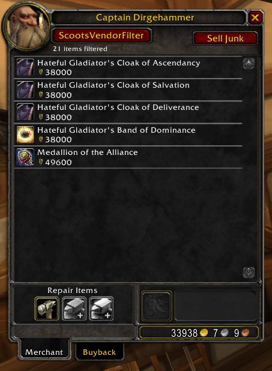
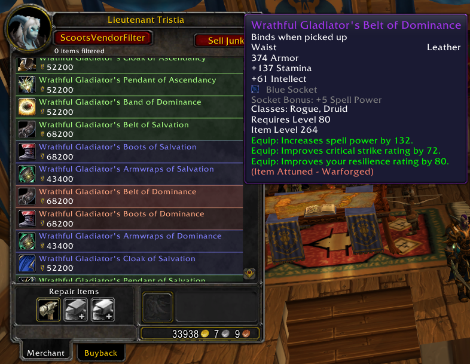
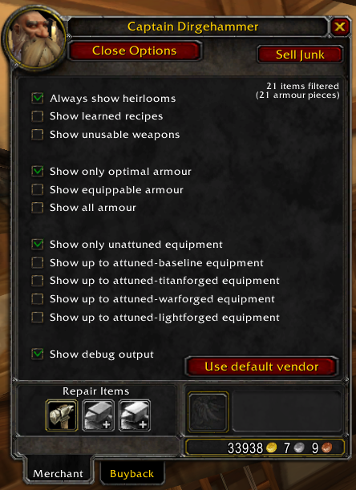

## Description ##

This addon converts vendor panels from paginated icons into a scrollable list.

Additionally, equipment you have already attuned or cannot equip, along with recipes you have already learned will be filtered out. These filters can be disabled via the integrated options panel.

When the attunement filter is disabled or lowered then already attuned items will be highlighted in the list.

## Installation ##

Download this repository, then extract the `ScootsVendorFilter` subdirectory from the `src` directory into your `World of Warcraft/Interface/AddOns` directory.

## Usage ##

When speaking to a vendor, you can access the options by clicking the button labeled "ScootsVendorFilter".

## Screenshots ##

